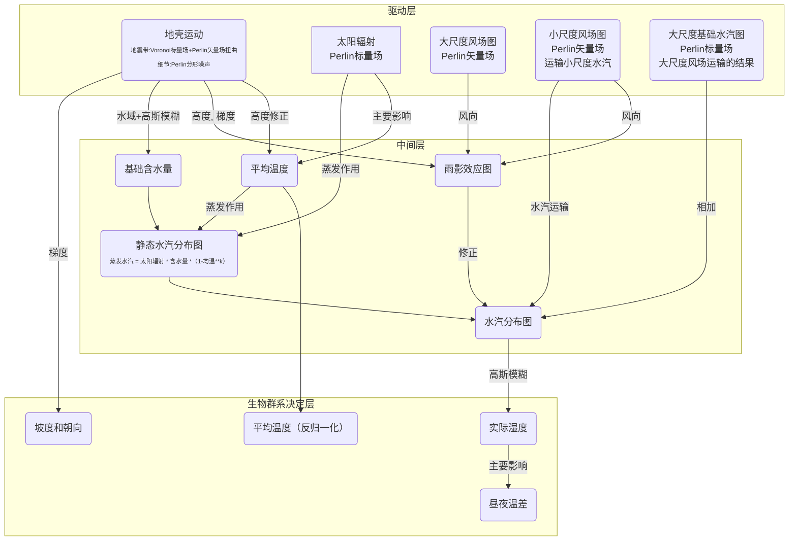

# 地形风格研究

## 运行方法
```
<pkpy_executable> test/test_math.py
```

## 备注


```mermaid
graph TD

    subgraph 驱动层

      I(地壳运动 <span style="font-size:10px">
      地震带:Voronoi标量场+Perlin矢量场扭曲
      细节:Perlin分形噪声
      </span>)
      S[太阳辐射 <br>Perlin标量场]
        

      F(大尺度风场图 <br>Perlin矢量场)
  
      K(小尺度风场图 <br>Perlin矢量场 <br>运输小尺度水汽)
  
      E(大尺度基础水汽图 <br>Perlin标量场 <br>大尺度风场运输的结果)

  
    end
  
    subgraph 中间层
  
      H(水汽分布图)
      M(雨影效应图)
      G(静态水汽分布图<span style="font-size:10px">
      蒸发水汽 = 太阳辐射 * 含水量 *（1-均温**k）
      </span>)
      C(基础含水量)
      A(平均温度)
    end
    
    subgraph 生物群系决定层
      X(实际湿度)
      D(平均温度（反归一化）)
      B(昼夜温差)
      J(坡度和朝向)
    end
      I -->|梯度| J
      I -->|水域+高斯模糊| C
      C --> G
      G --> H
      A -->|蒸发作用| G
      S -->|蒸发作用| G
      K -->|水汽运输| H
      E -->|相加| H 
      I -->|高度, 梯度| M
      K -->|风向| M
      F -->|风向| M

    
      H -->|高斯模糊| X

      M -->|修正| H
    
      S -->|主要影响| A
      I -->|高度修正| A
      X -->|主要影响| B
      A --> D
```
